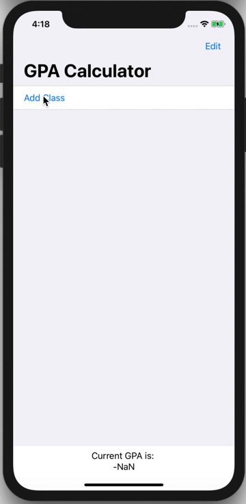
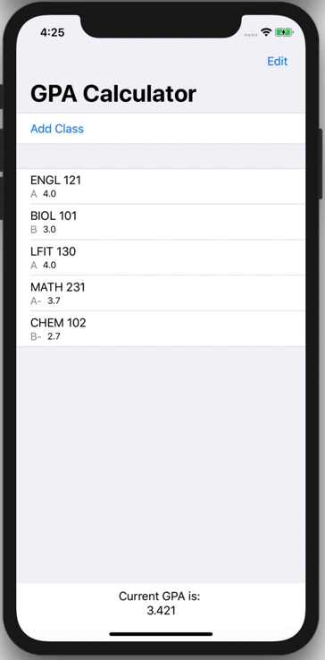
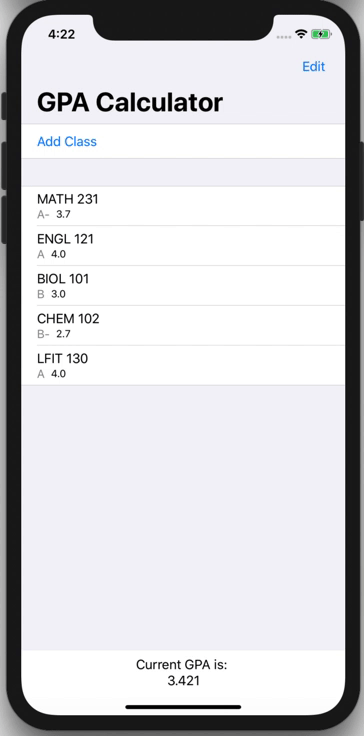

# GPA Calculator iOS App ➕➗✖️ 📱

This is an **iOS Application** that lets you enter the classes you took and then tracks and calculates your overall GPA.
- Built in the **Swift Programming Language**
- User Interface built using **SwiftUI**

## Key Features 

### Add, Remove and Reorder Classes:

  

### Dark Mode Support:
 

## Notes

This Application is based off the GPA System at UNC-Chapel Hill. The values in Class.swift can be adapted to represent the instiution you wish to calculate for. Here is a snippet of the code that determines this:
```swift
        switch grade{
        case "A":
            self.grade_num = 4.0;
        case "A-":
            self.grade_num = 3.7;
        case "B+":
            self.grade_num = 3.3;
        case "B":
            self.grade_num = 3.0;
        case "B-":
            self.grade_num = 2.7;
        case "C+":
            self.grade_num = 2.3;
        case "C-":
            self.grade_num = 2.0;
        case "D+":
            self.grade_num = 1.3;
        case "D":
            self.grade_num = 1.0;
        case "F":
            self.grade_num = 0;
        default:
            print("Some other character")

        }
```

## Areas for Improvement

- [ ] Add option to adjust GPA Weighting from within App
- [ ] Allow Classes to be organised into individual Semesters
- [ ] Calculate GPA per Semester
- [ ] Use Persistent Data (e.g. Core Data) to preserve the user inputs so it can track GPA.
